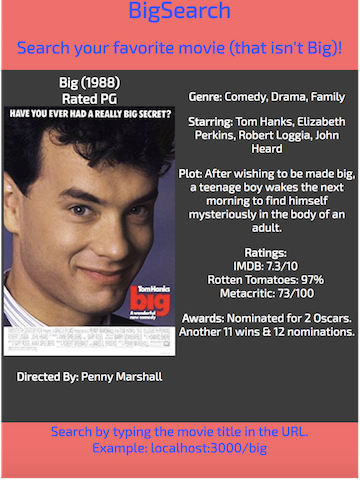

# BigSearch
Basic movie app using the OMDB API to set up RESTful routes.

## Set up:
~~~~
git clone https://github.com/tboneearls/bigsearch.git
npm install
npm start
~~~~

It will run locally by default on localhost:3000. From there, you can access the API by simply appending the movie title to the URL, as in localhost:3000/big.

This is also live on heroku at https://bigsearch.herokuapp.com. Again, simply append the movie title of your choosing, as in https://bigsearch.herokuapp.com/big. 

Enjoy!

## Snapshot:
